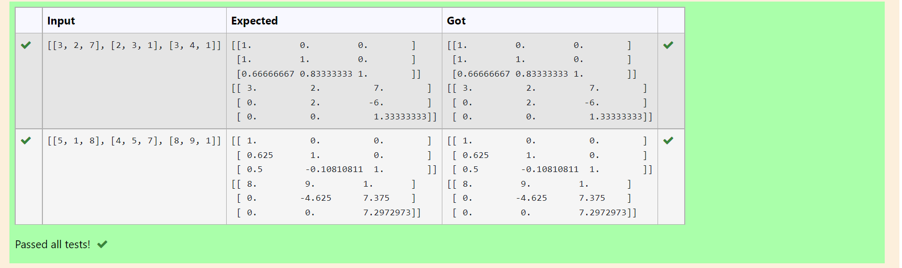
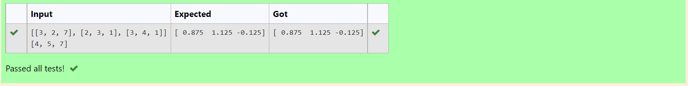

# LU Decomposition 

## AIM:
To write a program to find the LU Decomposition of a matrix.

## Equipments Required:
1. Hardware – PCs
2. Anaconda – Python 3.7 Installation / Moodle-Code Runner

## ALGORITHM:
### Step 1:
Import numpy library using import statement.

### Step 2:
From scipy package import lu_factor() and lu_solve().

### Step 3:
Get two inputs from user and pass it as matrix array.

### Step 4:
Find lu and pivot value of first matrix using lu_factor().

### Step 5:
Find solution of the matrix by using lu_solve() by passing lu, pivot values as first argument and second matrix as second argument.

### Step 6:
Print the solution.

## Program:
```
'''Program to find L and U matrix using LU decomposition.
Developed by:g.lutheesh
RegisterNumber:21005043 
'''

# To print L and U matrix
import numpy as np
from scipy.linalg import lu
A=np.array(eval(input()))
P,L,U=lu(A)
print(L)
print(U)


```

## Output:



## Result:
Thus the program to find the LU Decomposition of a matrix is written and verified using python programming.


# LU Decomposition 

## AIM:
To write a program to find the LU Decomposition of a matrix.

## Equipments Required:
1. Hardware – PCs
2. Anaconda – Python 3.7 Installation / Moodle-Code Runner

## ALGORITHM:
### Step 1:
Import numpy library using import statement.

### Step 2:
From scipy package import lu_factor() and lu_solve().

### Step 3:
Get two inputs from user and pass it as matrix array.

### Step 4:
Find lu and pivot value of first matrix using lu_factor().

### Step 5:
Find solution of the matrix by using lu_solve() by passing lu, pivot values as first argument and second matrix as second argument.

### Step 6:
Print the solution.

## Program:
```
'''Program to solve a matrix using LU decomposition.
Developed by:G.lutheesh 
RegisterNumber:21005043 
'''

# To print X matrix (solution to the equations)
import numpy as np
import scipy
from scipy.linalg import lu_factor,lu_solve
A=([[3, 2, 7], [2, 3, 1], [3, 4, 1]])
B=([4, 5, 7])
lu,piv=lu_factor(A)
x=lu_solve((lu,piv),B)
print(x)

```

## Output:



## Result:
Thus the program to find the LU Decomposition of a matrix is written and verified using python programming.


